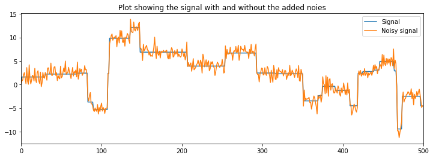
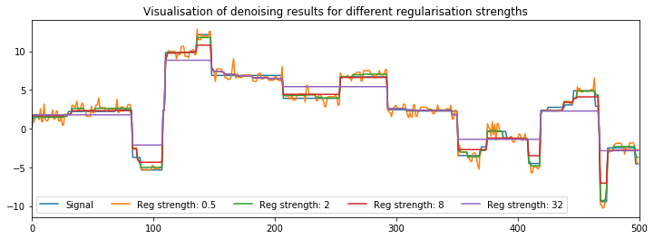

# CondatTV


Cython wrapper for the efficient TV denoising algorithm by Condat.

The algorithm is the improved fast total variation algorithm.
MATLAB and C-code is available on Condat's [webpage](https://lcondat.github.io/software.html)


## Example of denoising with total variation minimization

The following example is inspired by the experiments on syntetic data in [[1]](#[1])


```python
import condat_tv 
import numpy as np
import matplotlib.pyplot as plt
```

### Generate syntetic data


```python
np.random.seed(0)

N = 500 # number of samples

# Generate a sparse "derivative" vector 
signal_derivative = np.random.standard_normal(N)*4
for k in range(N):
    signal_derivative[k] = signal_derivative[k]*(np.random.uniform(0,1)>0.95)
    
# Integrate the sparse derivative vector to obtain a piecewise constant vector
signal = np.cumsum(signal_derivative)

# Add noise
noisy_signal = signal + np.random.standard_normal(signal.shape)
```

### Plot the syntetic data


```python
plt.figure(figsize=(12, 4))

plt.plot(signal, label="Signal")
plt.plot(noisy_signal, label="Noisy signal")

plt.xlim(0, N)
plt.legend()
plt.title("Plot showing the signal with and without the added noies")
plt.show()
```





### Denoise and visualize the results


```python
plt.figure(figsize=(12, 4))
plt.plot(signal, label="Signal")

for reg_strength in [0.5, 2, 8, 32]:
    # Denoise the signal with total variation minimization
    denoised_signal = condat_tv.tv_denoise(noisy_signal, reg_strength)
    
    # Visualize denoised signal
    plt.plot(denoised_signal, label=f"Reg strength: {reg_strength}")
    
    # Calculate and print RMSE
    RMSE = np.linalg.norm(denoised_signal-signal)/np.sqrt(N)
    print(f"Regularisation strength: {reg_strength:.1e}, RMSE: {RMSE:.2e}")
    
plt.xlim(0, N)
plt.legend(ncol=5)
plt.title("Visualisation of denoising results for different regularisation strengths")
plt.show()
```

    Regularisation strength: 5.0e-01, RMSE: 5.70e-01
    Regularisation strength: 2.0e+00, RMSE: 3.56e-01
    Regularisation strength: 8.0e+00, RMSE: 5.89e-01
    Regularisation strength: 3.2e+01, RMSE: 1.52e+00





# References

<p id="[1]">
    <b>[1]</b> Condat L. A direct algorithm for 1-D total variation denoising. IEEE Signal Processing Letters. 2013 Aug 15;20(11):1054-7. <a href="https://ieeexplore.ieee.org/abstract/document/6579659">(link)</a>
<p>

